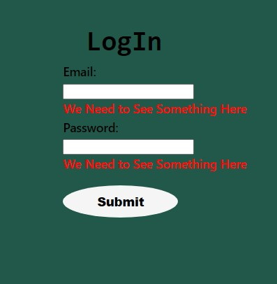

# Formik-Form
Create a user login form using Formik

  

## <ins>What it does

The animated bus route follows a marker along a local bus route.  I made several improvements over the original including a create marker function that creates a marker at each point on the map.  I also animated a second marker that moves to each point on the map as well as adding to the function to recenter the map at each movement.  I also used a more readable map and button style.

## <ins>How to Run

Load page and click the button in the top left hand corner.

## <ins>Future improvements

There are many future improvements that would be useful to the user including a more descriptive icons and markers to show the user where items are on the ma
